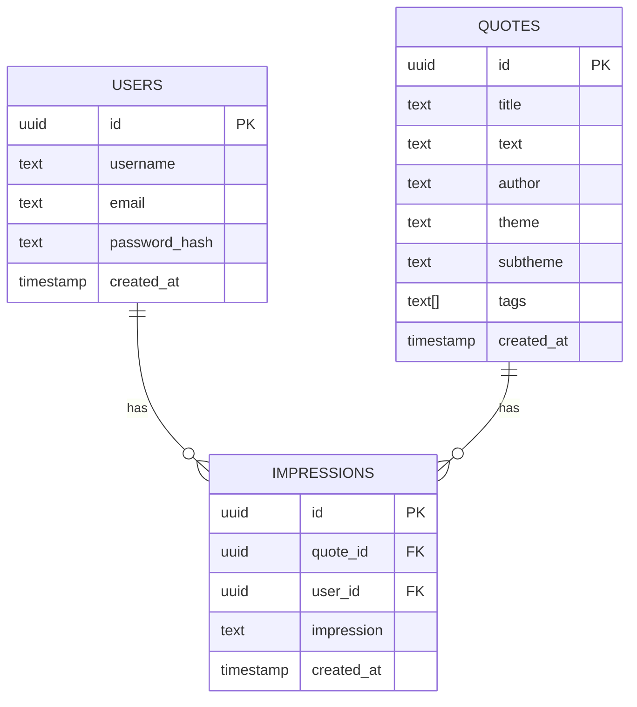

# Azuma Insight

## サービス概要
- 名言・引用・感想をコレクション・共有できるPWA対応Webアプリ
- 高度な検索・タグ・テーマ・統計機能を搭載

## 技術スタック
- フロントエンド: React + Vite + TypeScript + PWA
- バックエンド: FastAPI
- データベース: Supabase/PostgreSQL

## 主な機能
- 名言の登録・編集・削除・検索
- タグ・テーマ・サブテーマによる分類
- 感想（impression）の投稿
- 統計情報の表示
- PWA対応（オフライン利用・ホーム追加）

## セットアップ手順
1. 依存パッケージインストール
   ```
   cd frontend
   npm install
   ```
2. 開発サーバー起動
   ```
   npm run dev
   ```
3. 本番ビルド＆プレビュー
   ```
   npm run build
   npm run preview
   ```

## データベース設計

### users
| カラム名       | 型                       | 制約                | 説明         |
|:--------------|:-------------------------|:--------------------|:-------------|
| id            | uuid                     | PRIMARY KEY, DEFAULT gen_random_uuid() | ユーザーID   |
| username      | text                     | NOT NULL            | ユーザー名   |
| email         | text                     | NOT NULL, UNIQUE    | メールアドレス|
| password_hash | text                     | NOT NULL            | パスワードハッシュ|
| created_at    | timestamp with time zone | DEFAULT timezone('utc', now()) | 作成日時 |

### quotes
| カラム名    | 型                       | 制約                | 説明         |
|:-----------|:-------------------------|:--------------------|:-------------|
| id         | uuid                     | PRIMARY KEY, DEFAULT gen_random_uuid() | 名言ID      |
| title      | text                     | NOT NULL            | タイトル     |
| text       | text                     | NOT NULL            | 本文         |
| author     | text                     | NOT NULL, DEFAULT '成幸者への道' | 作者         |
| theme      | text                     |                     | テーマ       |
| subtheme   | text                     |                     | サブテーマ   |
| tags       | text[]                   |                     | タグ         |
| created_at | timestamp with time zone | DEFAULT timezone('utc', now()) | 作成日時 |

### impressions
| カラム名     | 型                       | 制約                | 説明         |
|:------------|:-------------------------|:--------------------|:-------------|
| id          | uuid                     | PRIMARY KEY, DEFAULT gen_random_uuid() | 感想ID      |
| quote_id    | uuid                     | NOT NULL, REFERENCES quotes(id) ON DELETE CASCADE | 名言ID      |
| user_id     | uuid                     | NOT NULL, REFERENCES users(id) ON DELETE CASCADE | ユーザーID  |
| impression  | text                     | NOT NULL            | 感想         |
| created_at  | timestamp with time zone | DEFAULT timezone('utc', now()) | 作成日時 |

#### ER図（Mermaid記法）


## API仕様（主要エンドポイント）

| メソッド | パス                  | 概要                     | 主なパラメータ・ボディ         |
|:---------|:----------------------|:-------------------------|:------------------------------|
| GET      | /quotes               | 名言一覧取得             | limit, offset, theme, tags, author, sort_by, sort_order  |
| GET      | /quotes/{quote_id}    | 名言詳細取得             | quote_id                      |
| POST     | /quotes               | 名言新規作成             | title, text, author, theme, subtheme, tags              |
| PUT      | /quotes/{quote_id}    | 名言更新                 | quote_id, 更新内容            |
| DELETE   | /quotes/{quote_id}    | 名言削除                 | quote_id                      |
| GET      | /quotes/search        | 名言キーワード検索       | q, search_fields, search_type, limit, offset            |
| GET      | /quotes/tags          | タグによる名言検索       | tags, match_all, limit, offset                          |
| GET      | /quotes/theme/{theme} | テーマ別名言取得         | theme, limit, offset           |
| GET      | /quotes/random        | ランダム名言取得         | なし                          |
| GET      | /stats                | 統計情報取得             | なし                          |

- 認証: 現状のAPIには認証必須エンドポイントは見当たりません（今後追加可能）

## システム構成
- フロントエンド: Vite + React + TypeScript + PWA（`frontend/`）
- バックエンドAPI: FastAPI（`api/main.py`）
- データベース: Supabase/PostgreSQL（SQLスクリプトは`sql/azuma-insight/`）
- 通信: REST API（CORS対応済み）
- 認証: 今後追加可能（現状は未実装）

## 工夫点・アピールポイント
- PWA対応でスマホ・PCどちらでも快適
- 高度な検索・統計機能
- Supabase/PostgreSQLによるスケーラブルなDB設計